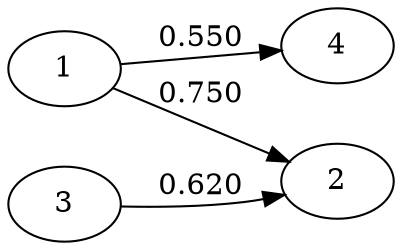

# Design Document

## Overview

This document describes the design decisions, algorithms, and data structures used in dytopo-rs.

## Core Algorithm: Dynamic Topology Routing

Based on the DyTopo paper (arXiv:2602.06039), the core algorithm dynamically reconstructs communication topology at each reasoning round.

### Round Execution

```
for round in 0..num_rounds:
    1. goal = manager.round_goal(round)

    2. for agent in agents:
           io = agent.step(round, goal, inbox[agent])
           // io contains: query (need), key (offer), draft (work)

    3. topology = router.build_topology(keys, queries)
       // Creates sparse directed graph

    4. for edge in topology:
           message = format_message(sender.draft, sender.key)
           inbox[receiver].push(message)
           // Apply inbox cap if configured
```

### Semantic Matching

The routing decision is based on semantic similarity between:
- **Key (sender)**: What the agent can contribute
- **Query (receiver)**: What the agent needs

Score computation:
```
score(sender -> receiver) = cosine(embed(key_sender), embed(query_receiver))
```

### Sparsification

To avoid context explosion, the full similarity matrix is sparsified:

```
for each receiver:
    candidates = all senders (excluding self)
    sorted = sort_by_score(candidates, descending)
    selected = []

    for candidate in sorted:
        if len(selected) >= topk:
            break
        if candidate.score >= min_score:
            selected.append(candidate)

    // Force-connect: ensure at least one edge
    if force_connect and len(selected) == 0:
        selected.append(sorted[0])  // Best available
```

## Agent Protocol

### AgentIO Schema

```rust
struct AgentIO {
    agent_id: AgentId,
    query: String,    // What I need (max 280 chars baseline)
    key: String,      // What I offer (max 280 chars baseline)
    draft: String,    // Work product (max 2k chars in trace)
}
```

### Query/Key Design

Effective queries and keys are:
- **Specific**: "Need arithmetic validation" not "Need help"
- **Domain-tagged**: "[math] Need..." for routing clarity
- **Complementary**: Query describes gap, key describes capability

Example:
```
Agent 1 (math specialist):
  query: "[math] Need code implementation of the formula"
  key: "[math] Offer: algebra, arithmetic, unit checking"

Agent 2 (code specialist):
  query: "[code] Need mathematical formulas to implement"
  key: "[code] Offer: patch ideas, debugging, compile errors"
```

## Embedding Strategies

### HashEmbedder (Baseline)

Deterministic, dependency-free embedding for testing:

```rust
fn embed(text: &str) -> Vec<f32> {
    let mut v = vec![0.0; dim];
    for token in tokenize(text):
        h = fnv_hash(token, seed)
        idx = h % dim
        sign = if h >> 63 == 0 { 1.0 } else { -1.0 }
        v[idx] += sign
    return l2_normalize(v)
}
```

Properties:
- Deterministic across platforms
- Same words -> similar embeddings (bag-of-words behavior)
- NOT semantically meaningful

### Semantic Embedders (Planned)

For real applications:

**FastEmbed (ONNX)**:
- Uses sentence-transformers models
- Requires ONNX runtime
- Feature-gated: `--features embed-fastembed`

**Candle (Pure Rust)**:
- Uses Hugging Face candle library
- No external runtime
- Feature-gated: `--features embed-candle`

## Message Delivery

### Inbox Management

Each agent maintains an inbox of recent messages:

```rust
struct Inbox {
    messages: Vec<String>,
    max_size: usize,
}

fn push(&mut self, msg: String) {
    self.messages.push(msg);
    if self.messages.len() > self.max_size {
        // Drop oldest
        self.messages.drain(0..excess);
    }
}
```

### Message Format

Messages delivered along edges:
```
"From agent {id}: {draft} // {key}"
```

This gives the receiver:
- Identity of sender
- Work product (draft)
- Capability context (key)

## Trace Format

JSONL with tagged event types:

### round_start
```json
{"type":"RoundStart","round":0,"goal":"...","agent_count":5,"ts_unix_ms":1234}
```

### agent_io
```json
{"type":"AgentIO","round":0,"agent_id":1,"query":"...","key":"...","draft":"..."}
```

### topology
```json
{"type":"Topology","round":0,"edges":[{"from":1,"to":2,"score":0.75},...]}
```

### message
```json
{"type":"Message","round":0,"from":1,"to":2,"score":0.75,"content":"..."}
```

### round_end
```json
{"type":"RoundEnd","round":0,"ts_unix_ms":1235}
```

## LLM Integration (Planned)

### Agent Prompt Structure

```
You are agent {id} with specialty: {specialty}

Current goal: {round_goal}

Your inbox:
{inbox_messages}

Respond with JSON:
{
  "query": "What information or help do you need?",
  "key": "What can you contribute?",
  "draft": "Your current work on the problem"
}

Rules:
- query and key must be <= 280 characters
- Be specific about needs and offerings
- Reference inbox content when relevant
```

### JSON Repair

If LLM output fails to parse:
1. Extract content that looks like JSON
2. Retry with repair prompt:
   ```
   Your previous response was not valid JSON.
   Please respond ONLY with valid JSON:
   {"query":"...","key":"...","draft":"..."}
   ```
3. If retry fails, use fallback defaults

## Visualization

### DOT Format

GraphViz DOT for topology visualization:



Render with:
```bash
dot -Tsvg topology.dot -o topology.svg
```

### Interpretation

- Node = Agent ID
- Edge direction = Information flow (sender -> receiver)
- Edge label = Similarity score
- Subgraphs = Communication clusters

## Configuration

### CLI Arguments

```
dytopo-cli demo
    --rounds N          Number of rounds (default: 3)
    --agents N          Number of workers (default: 5)
    --topk N            Max incoming edges (default: 2)
    --min-score F       Similarity threshold (default: 0.10)
    --force-connect     Ensure one edge per receiver (default: true)
    --max-inbox N       Inbox size cap (default: 3)
    --task "..."        Problem description
    --out DIR           Output directory (default: traces)
```

### Environment Variables (Planned)

```
DYTOPO_OLLAMA_URL    Ollama base URL (default: http://localhost:11434)
DYTOPO_MODEL         Default model name (default: llama2)
```

## Error Handling

### Strategy

- **Anyhow** in CLI for ergonomic error propagation
- **Result<T>** everywhere for explicit error paths
- **No panics** in library code

### Recovery

- Embedding failure: Propagate error, fail round
- LLM timeout: Retry once, then use stub fallback
- File I/O: Create directories, propagate on failure

## Testing Strategy

### Unit Tests

- Embedding determinism
- Router sparsification logic
- Agent protocol compliance

### Integration Tests

- End-to-end demo execution
- Trace format validation
- DOT file syntax

### Property Tests (Planned)

- Router always produces valid topology
- No self-edges in output
- Force-connect guarantees coverage
